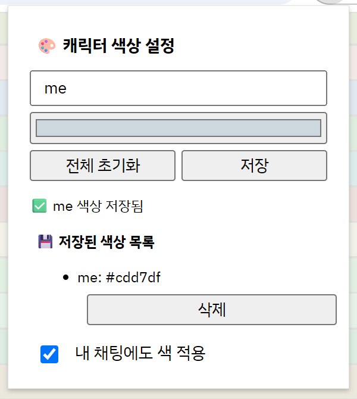
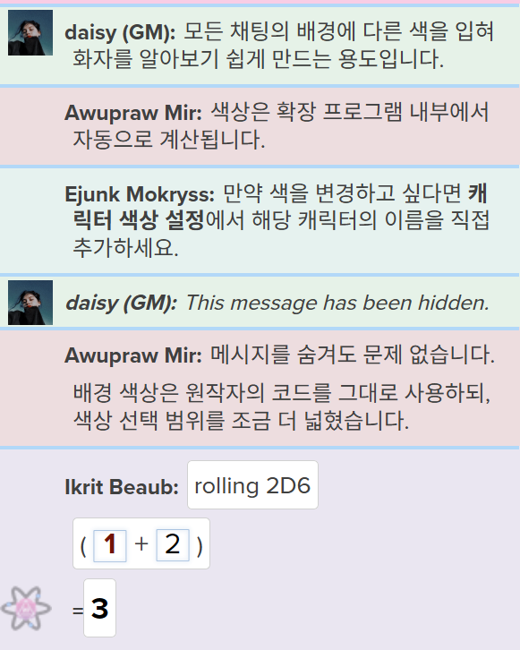
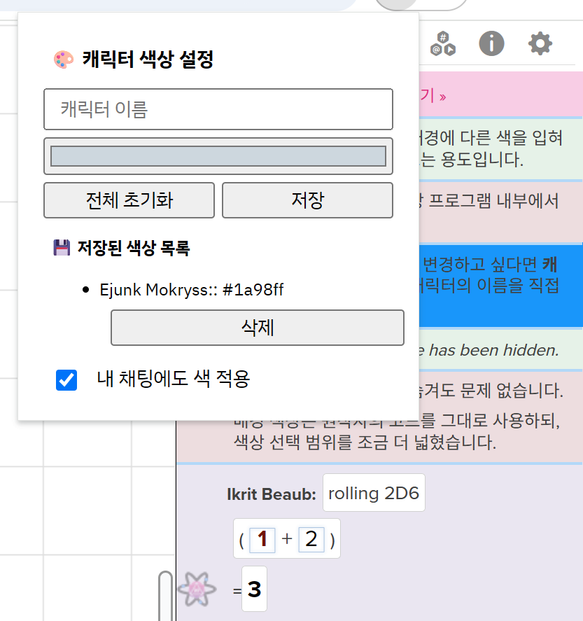
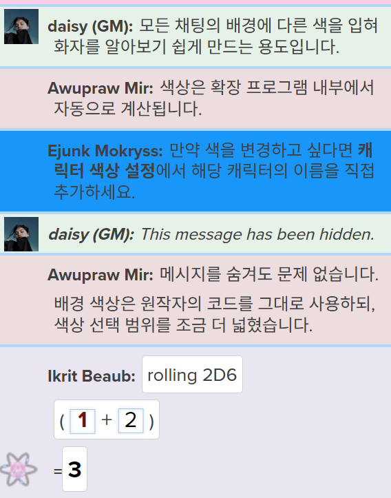

## 🎨 Roll20 Colourise - New(Remake)

- 이 프로젝트(확장 프로그램)는 Xavier Ho의 ["Roll20 Colouriser"](https://github.com/Spaxe/roll20-colouriser)를 원작자의 허가를 받아 다시 만든 것입니다.
- 더하여 신청자/원본 제작자의 합의 아래, 확장 프로그램 및 소스 코드를 전체 공개합니다. 실제 프로그램은 [이곳](https://chromewebstore.google.com/detail/bdmnfebmomokholhpmfdglgohkolbikp?utm_source=item-share-cb)에서 설치하실 수 있습니다.

---

### 📝 업데이트 내역
- 2.6.0(최신): 특정한 상황에서 채팅 배경 색상이 사라지는 오류 수정, 배경 색상 계산식 수정, README 수정, 내부 성능 개선
- 2.5.0: 채팅 배경 색상 적용 방식을 더욱 간결하게 변경, 숨김 처리된 메시지(`This message has been hidden.`)에도 색상이 적용되도록 수정
- 2.4.0: 리팩토링, 네이버 웨일에서 제보된 오류 수정 및 네이버 웨일 스토어 등록
- 2.3.2: 프로그램 적용 범위 변경
- 2.3.0: '내 채팅에도 색 적용' 기능 추가
- 2.2.0: 채팅 배경 색상을 더 연하게 수정
- 2.1.0: 사용하지 않는 권한 제거 후 구글 심사 통과
- 2.0.0: 최초 작성

---

### ⚙️ 기능
- 원본 확장과 거의 비슷합니다. 대신 **사용자가 직접 색상을 지정할 수 있는 기능**과 **자신의 채팅에 색상을 입힐지 입히지 않을지 선택하는 기능**이 추가되었습니다.


<br>
<br>


- 위와 같이 사용자가 색상을 지정하지 않았거나 초기화했다면, 프로그램에서 기본적으로 설정된 색상이 나옵니다.



- 위와 같이 사용자가 색상을 지정했다면, 그 색상이 나옵니다. 이 경우에는 글씨가 잘 보이도록 직접 조절해 주세요.

---

### ❓ FAQ
- **Q. 채팅 사이에 파란색으로 가로 선이 떠요. 어떻게 없애나요?**
  - A. [이 글](https://posty.pe/oetg40)을 참고해 주세요. 코드 내에서 없애는 방법은 찾지 못했습니다.

- **Q. 색이 비슷해 보여요.**
  - A. 그동안은 원작자의 색상 계산식을 그대로 사용했습니다. 2.6.0 버전에서 색상 사용 범위를 넓혔습니다.

- **Q. 그래도 색이 비슷해 보여요!**
  - A. 죄송합니다. 색상 출력 순서는 제가 결정할 수 없습니다. 저널을 삭제하고 새로 만들거나 직접 색상을 지정해 주세요.

- **Q. 저는 수정 전의 색이 좋아요.**
  - A. Github [Releases 페이지](https://github.com/daisy-4urdayz/roll20-colourise-new/releases)에서 최신 버전(Latest)의 zip 파일을 다운로드해 주세요. 이후 압축을 푸신 뒤, `main.js` 파일을 삭제하고 `main-legacy.js` 파일의 이름을 `main.js`로 변경한 다음, 사용 중인 브라우저의 개발자 옵션에서 직접 확장을 추가하셔야 합니다.

- **Q. 채팅에 색이 입혀지지 않아요.**
  - A. 사용자의 눈에 보이는 채팅 순서와 Roll20이 처리하는 실제 채팅 순서가 달라서 생기는 문제입니다. 2.6.0 버전에서 수정했지만 Roll20 API(Mode)와 겹칠 경우 이 문제는 재발할 수 있습니다.

- **Q. 이런 기능 추가해 주실 수 있나요?**
  - A. 네. 대신 제가 시간이 날 때만 건드릴 수 있어서 업데이트가 느릴 수는 있습니다.

- **Q. 문제가 생겼어요.**
  - A. <d9916859@gmail.com>으로 메일 보내 주세요. 필수는 아닙니다만 **1. 어떤 상황에서 해당 문제가 생겼는지, 2. 어떤 브라우저를 사용 중인지(브라우저의 버전 포함), 3. 따로 사용 중인 확장 프로그램이나 Roll20 API(Mode)가 있는지, 4. Roll20 Colourise의 버전이 어떻게 되는지**까지 적어 주시면 저에게 매우 큰 도움이 됩니다.

---

### 📂 폴더 구조
```
roll20-colourise-new/
├─ icon/                    ← 확장 프로그램 아이콘
├─ image/                   ← 샘플 이미지
├─ main-legacy.js           ← 구버전 메인 스크립트
├─ main.js                  ← 메인 스크립트
├─ manifest.json            ← 확장 프로그램 설정 파일
├─ popup.css                ← 팝업 CSS
├─ popup.html               ← 팝업 HTML
├─ popup.js                 ← 팝업 스크립트(JS)
├─ README.md                ← 설명서
└─ roll20-colourise.zip     ← 배포용(Github 업로드용) 압축 파일
```

---

### 📧 기타
- 제작자: daisy, 원본 제작자: Xavier Ho
- 문의: [Github Issues](https://github.com/daisy-4urdayz/roll20-colourise-new/issues) 또는 <d9916859@gmail.com>
- 로고에 사용된 배경은 <a href="https://unsplash.com/ko/%EC%82%AC%EC%A7%84/%EC%97%AC%EB%9F%AC-%EA%B0%80%EC%A7%80-%EC%83%89%EC%83%81%EC%9D%98-%EB%B0%B0%EA%B2%BD%EC%9D%B4-%ED%9D%90%EB%A6%BF%ED%95%9C-%EC%9D%B4%EB%AF%B8%EC%A7%80-Cxt_W7nqLvM?utm_content=creditCopyText&utm_medium=referral&utm_source=unsplash">Unsplash</a>, <a href="https://unsplash.com/ko/@plufow?utm_content=creditCopyText&utm_medium=referral&utm_source=unsplash">Plufow Le Studio</a>의 작품입니다.
